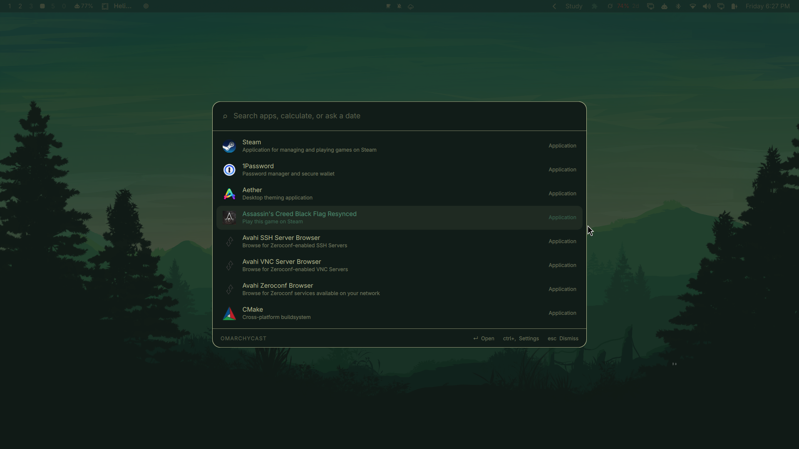
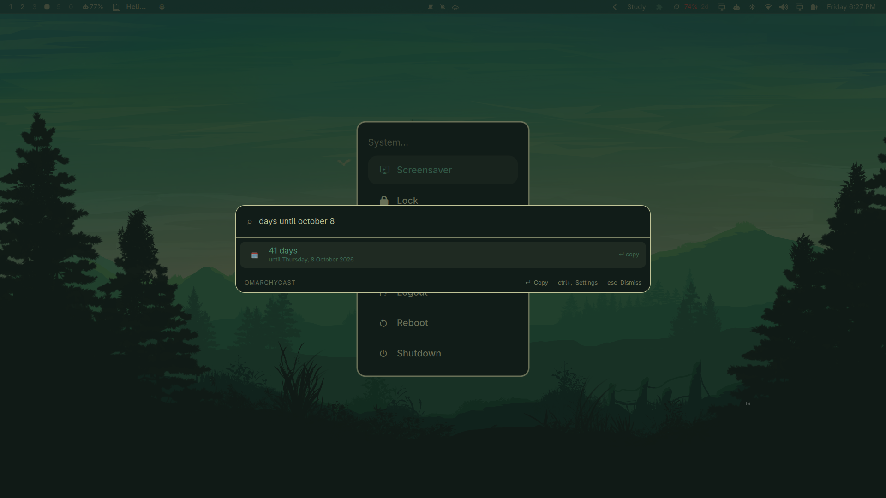
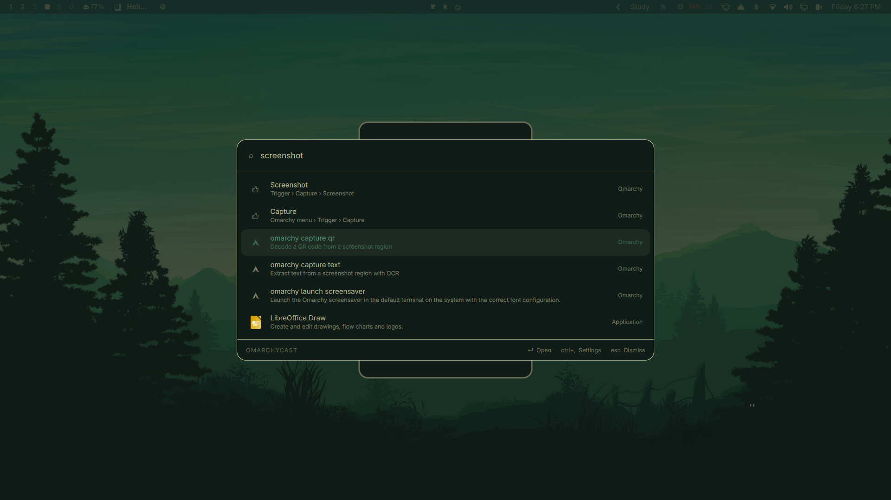
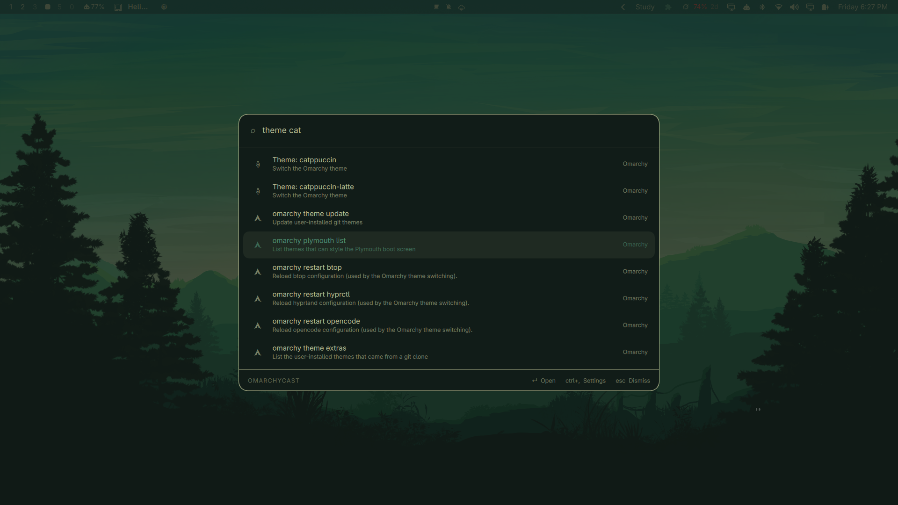
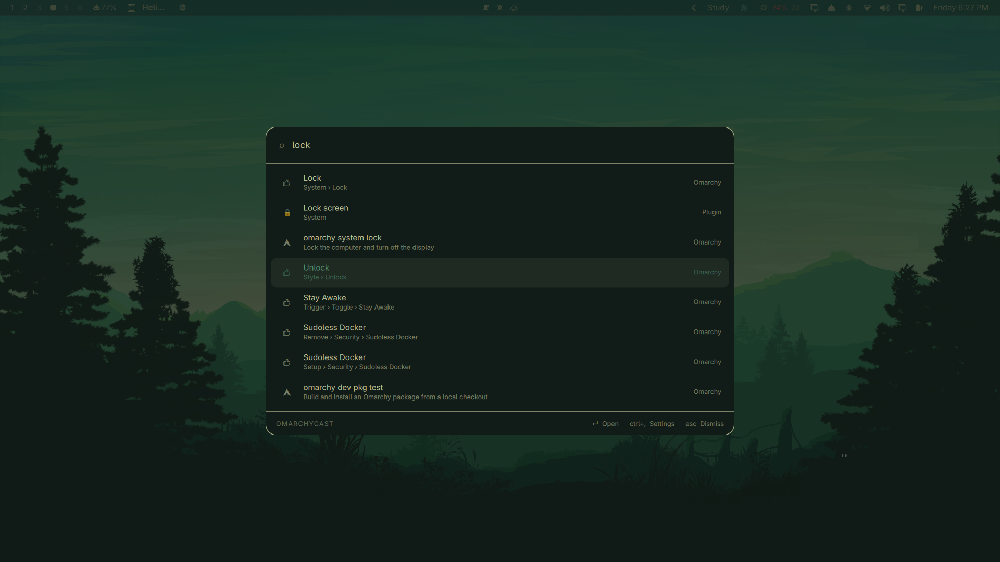

# Omarchycast

A keyboard launcher for [Omarchy](https://omarchy.org). One hotkey, one field.

**Raycast-style calculations work directly in the search bar** — type `1920 * 0.85`
or `25 GB to MB` and the answer is the first result, no mode to switch into and no
calculator to open. Alongside that: fuzzy app search that learns what you actually
open, date arithmetic, and your markdown notes, all in the same list.



Dates are answered in the same field, with no mode to switch into:



| Omarchy, searchable | Theme switching |
|---|---|
|  |  |

| Plugins beside system entries | |
|---|---|
|  | |

## Why it is built this way

Omarchycast is a Quickshell **overlay plugin**, so the interface runs inside the
Omarchy shell process that is already on screen rather than in a browser engine
of its own. Search itself lives in a small Rust daemon that keeps the app index
in memory and answers over a unix socket.

The result is a launcher that costs about **9 MB** resident and answers a
keystroke in **~0.4 ms**, including the round trip. An equivalent build on a
webview stack measured 356 MB across three processes on the same machine.

```
   CTRL + SPACE
        │
        ▼
  Omarchycast.qml ── overlay, inside the running Quickshell process
        │         layer-shell, exclusive keyboard focus
        │  newline-delimited JSON over $XDG_RUNTIME_DIR/omarchycast.sock
        ▼
  omarchycastd ───── app index · fuzzy + frecency · calculator · dates · notes
```

## What it does

| Type this | You get |
|---|---|
| `firefox` | Fuzzy app search, ranked by how often and how recently you launch things |
| `1920 * 0.85` | `1632` — Enter copies it |
| `25 GB to MB`, `5 miles to km`, `0xff to decimal`, `15% of 240` | Unit, base and percentage conversion |
| `days until october 8` | `41 days — until Thursday, 8 October 2026` |
| `30 days from now`, `2 weeks ago` | The resulting date |
| `checklist` | Your markdown notes, matched on title and body |
| `note Groceries` | Creates that note and opens it |
| `clipboard` | Opens Omarchy's clipboard manager |
| `nightlight`, `suspend`, `screenshot` | Omarchy itself: every menu entry, runnable `omarchy` command, and installed theme |
| `theme catppuccin` | Switches the Omarchy theme |
| `settings` | The settings pane |

Ranking is fuzzy relevance first, with a frecency boost — usage damped
logarithmically and decayed on a 14-day half-life — so familiar apps rise
without ever outranking a clearly better textual match. An empty query lists
what you open most.

On first open you get a short tour: six example queries you can press `↵` on to
run for real, rather than a page of instructions. Type `tour` to see it again.

### Keys

| Key | Action |
|---|---|
| `↑` `↓`, `Ctrl+N` `Ctrl+P` | Move through results (wraps) |
| `↵` | Open, or copy for calculator and date rows |
| `⇧↵` | Copy a calculation together with its expression |
| `Ctrl+,` | Settings |
| `Esc` | Clear the query, then dismiss |

## Install

Requires Omarchy (Quickshell 0.3+), Hyprland, and a Rust toolchain to build the
daemon. `wl-clipboard` is needed for copying.

```bash
omarchy plugin add https://github.com/Aditya-Raj-Tiwari/omarchycast.git --enable
cd ~/.config/omarchy/plugins/io.github.aditya-raj-tiwari.omarchycast
make install
omarchycastd hotkey 'CTRL + SPACE'
```

`omarchycastd hotkey` writes `~/.config/hypr/omarchycast.lua` and adds one `dofile` line
to `hyprland.lua`. Wayland has no client-side global hotkey, so the binding has
to live in the compositor's config; keeping it in its own file makes it easy to
see and to remove.

Start the daemon at login by adding it to `~/.config/hypr/autostart.lua`:

```lua
hl.exec_once("omarchycastd")
```

The overlay also starts the daemon on demand if it isn't running.

## Settings

`Ctrl+,` or type `settings`. Everything is stored in
`~/.config/omarchycast/config.json` and applies immediately.

- **Hotkey** — click the field, press a combination; it rewrites the Hyprland binding and reloads.
- **Sources** — enable apps, calculator, dates, notes, plugins and Omarchy individually, cap how many rows each contributes, and set the notes folder.
- **Appearance** — width, visible rows, corner radius, whether to follow the Omarchy theme, **compact or comfortable density**, and a **font size** control (70–160 %).
- **Behaviour** — dismiss on click-away, what Escape does, and whether an empty query lists frequent apps.

## Notes

Notes are markdown files in `~/Notes` (configurable). Titles come from the first
`# heading`, falling back to the filename. Typing `note <title>` creates one and
opens it straight away, so capturing a thought is a single keystroke.

Notes open in **Omacastnotes**, the floating markdown viewer bundled in
`notesapp/` (formerly shadow-notes) and installed by `make install`:

```bash
omacastnotes                 # the scratchpad
omacastnotes ~/Notes/foo.md  # a specific note
```

Each note gets its own instance id, so opening a second note gives it a new
window while re-opening the same note focuses the one already on screen.

Titles are matched fuzzily and body text literally — a fuzzy match against a
whole document scores almost anything and buries the note you meant.

## Omarchy, searchable

The launcher indexes Omarchy itself: every entry of the Omarchy menu (with its
breadcrumb, e.g. *System › Suspend*), every documented `omarchy` command that
can run without arguments (from `omarchy commands --json`), and one row per
installed theme. Menu actions that are plain commands run directly; anything
with shell syntax falls back to summoning the menu at that entry, which is the
surface built to run it. Commands that need elevated privileges or mandatory
arguments are not indexed — the launcher never invokes a privilege boundary.

## Plugins

Drop a JSON manifest into `~/.config/omarchycast/plugins/` and its commands
join the results — no recompiling. A manifest can contribute **static
commands**, fuzzy-matched like applications:

```json
{
  "name": "System",
  "commands": [
    { "title": "Lock screen", "glyph": "🔒", "exec": ["omarchy-lock-screen"] },
    { "title": "Copy hostname", "copy": "my-host" }
  ]
}
```

and an optional **dynamic source**: a `keyword` plus a `query` argv, run only
when the query starts with that keyword. The script receives the rest of the
query as its final argument and prints one JSON object per line —
`{"title": "…", "copy": "…"}` or `{"title": "…", "exec": ["cmd", "arg"]}`.

Commands are argv arrays, never shell strings. Dynamic scripts run only when
their keyword is typed, under a 700 ms budget and a 64 KB output cap, and are
killed on overrun. Manifests are hot-reloaded when the directory changes. What
an installed plugin's own programs do is the user's business — the daemon
bounds what it reads from them, not what they are.

## Clipboard

Omarchy already ships a clipboard manager, so Omarchycast does not keep a second
history. Typing `clipboard` opens Omarchy's own overlay instead.

## Uninstall

```bash
make uninstall
omarchy plugin remove io.github.aditya-raj-tiwari.omarchycast
```

Then delete the two `Added by omarchycast` lines from `~/.config/hypr/hyprland.lua`.

## Development

```bash
make dev     # symlink the working tree into the plugin dir, then rescan
make test    # daemon unit tests
make check   # clippy + omarchy plugin validate
omarchycastd eval '25 GB to MB'    # exercise the engines without the UI
```

Adding a search source means implementing one trait in `daemon/src/providers/`:

```rust
pub trait Provider: Send + Sync {
    fn id(&self) -> &'static str;
    fn query(&self, q: &Query) -> Vec<Item>;
    fn activate(&self, id: &str, action: Action) -> Result<Outcome>;
    fn reindex(&self) {}
}
```

`query` runs on every keystroke and must stay in the sub-millisecond range —
build the index in `reindex`, never in `query`.

## Licence

MIT
